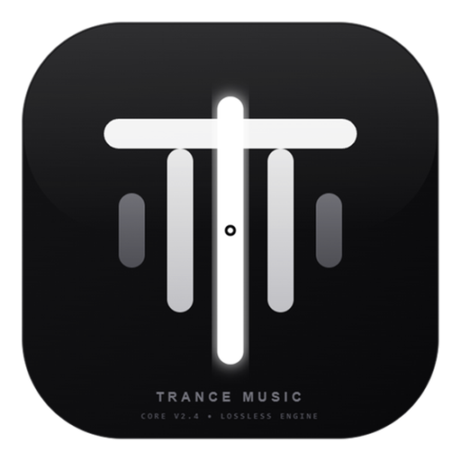
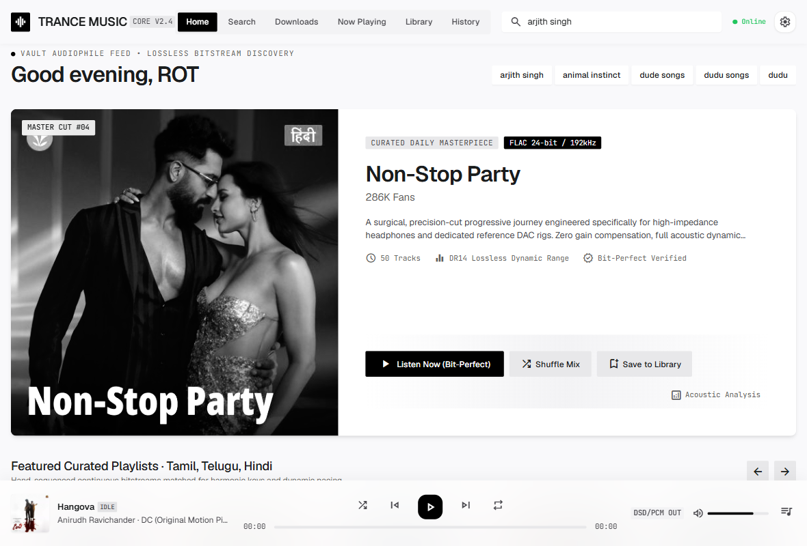
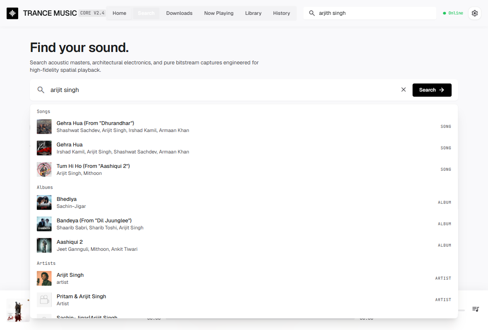
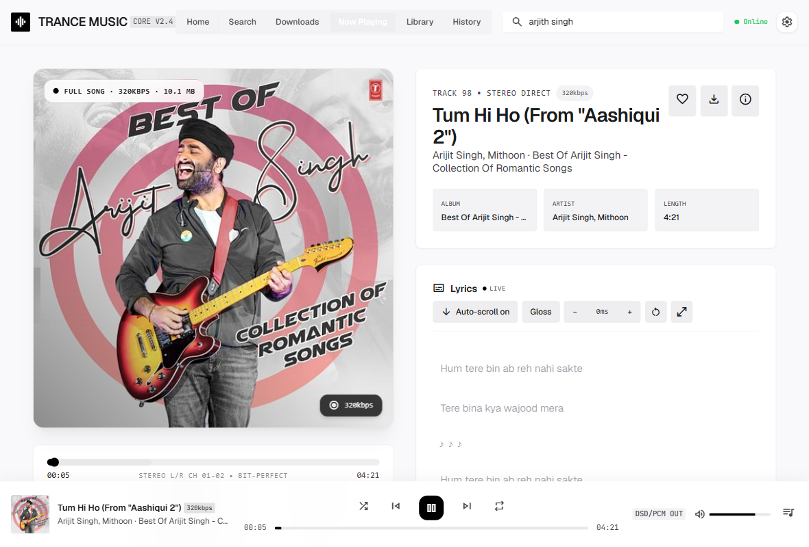
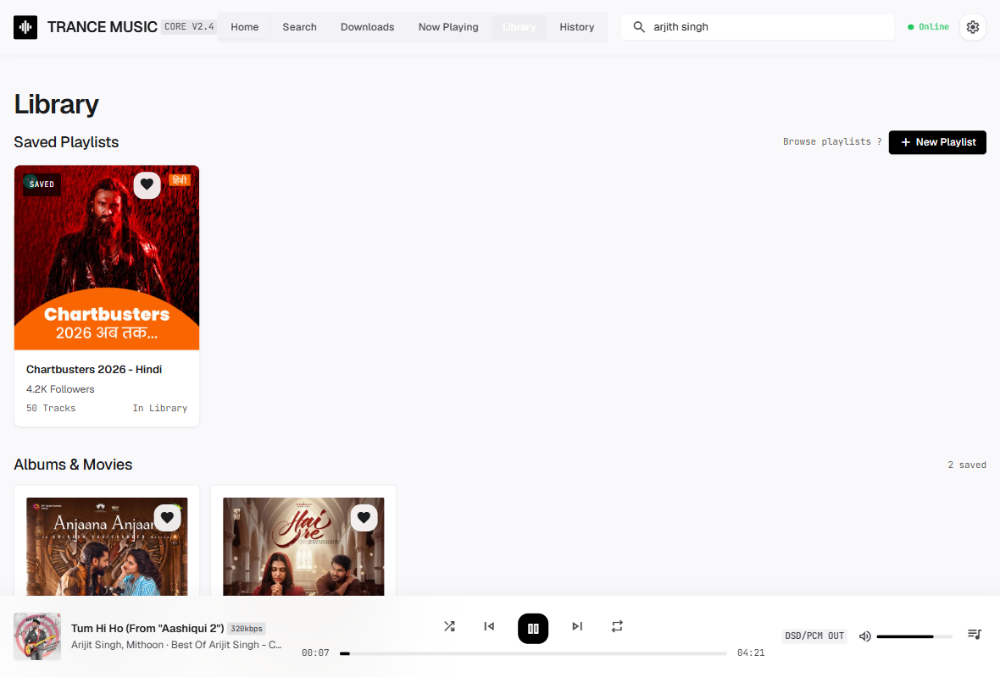
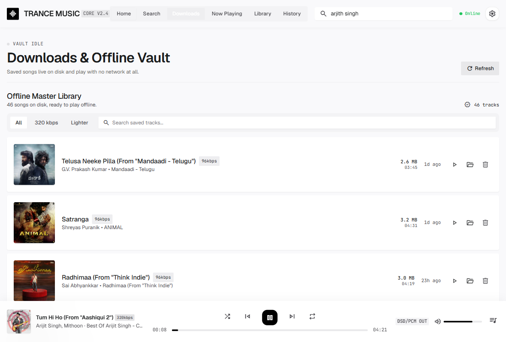
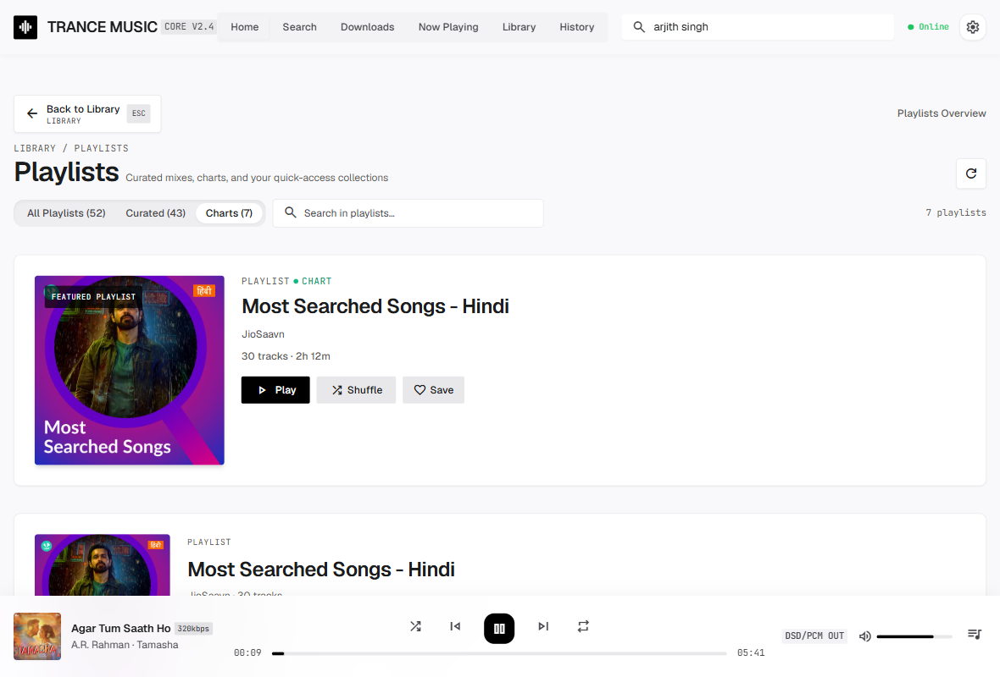
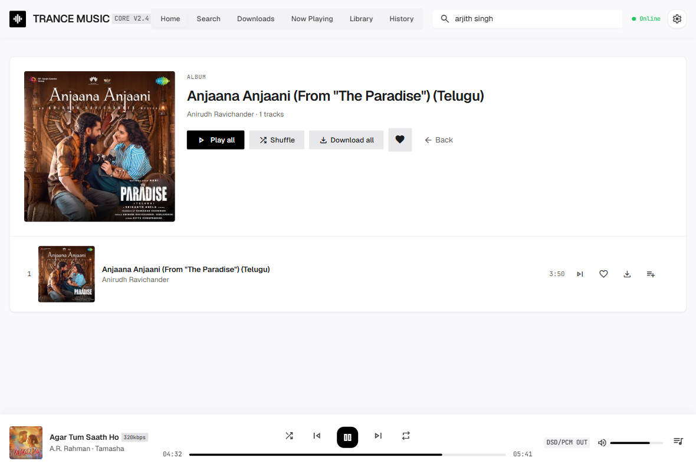
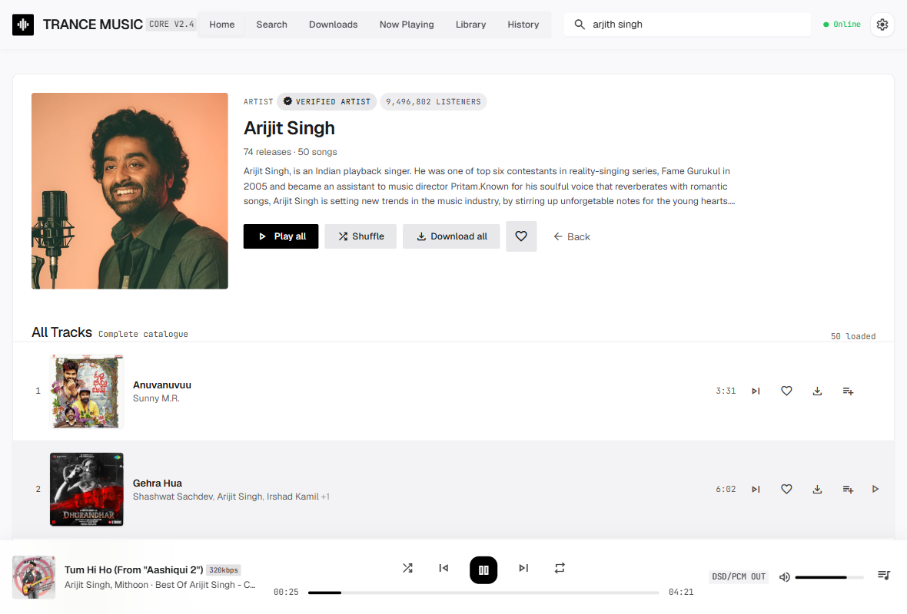
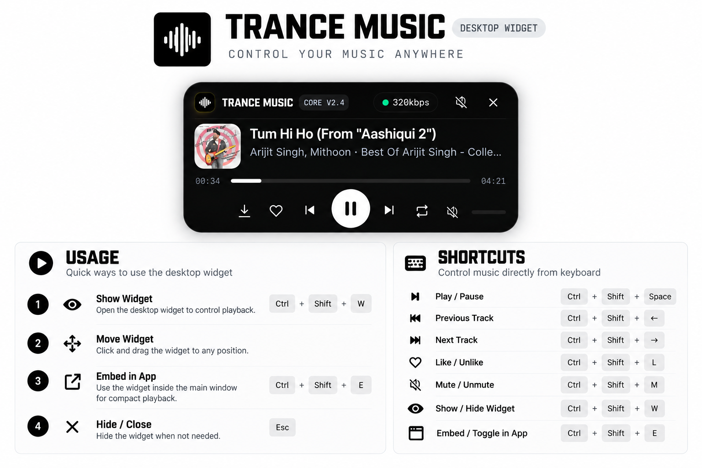

<hr>

<div align="center">



# OPEN MUSIC

**A bit-perfect streaming music player for Windows, Linux and macOS — Tauri 2 shell, Rust core, zero-build vanilla-JS front end.**

[](https://github.com/Rohithdgrr/OPEN-MUSIC/releases/latest)
[](https://github.com/Rohithdgrr/OPEN-MUSIC/actions/workflows/ci.yml)
[](LICENSE)
[](https://github.com/Rohithdgrr/OPEN-MUSIC/releases/latest)
[](https://nasa-ammos.github.io/slim/)

[Releases](https://github.com/Rohithdgrr/OPEN-MUSIC/releases/latest) · [Changelog](CHANGELOG.md) · [Architecture](docs/architecture.md) · [Contributing](CONTRIBUTING.md) · [Security](SECURITY.md) · [Issues](https://github.com/Rohithdgrr/OPEN-MUSIC/issues)

</div>

---

## Video tour

<video src="docs/media/trance-music-tour.mp4" poster="docs/media/trance-music-tour-poster.jpg" controls width="100%"></video>

*A 60-second tour of the v0.3.0 Windows build — Home, search, live playback with
synced lyrics, Library, charts, album and artist pages, and the offline vault.*



## What this is

OPEN MUSIC is a desktop music player that streams from JioSaavn through a
local relay, keeps an offline vault on disk, and ships as one signed,
self-updating package for Windows, Linux and macOS.

The interesting part is not the chrome — it is what happens underneath:

- **Media never touches a third-party CDN from the WebView.** The Rust core
  decrypts and qualifies every stream URL, then serves it from an ephemeral
  `127.0.0.1` byte-range relay. The front end is sandboxed to `default-src 'self'`.
- **Playback is proven before it is promised.** A three-probe range
  qualification runs before a track starts, which is what earns the
  *Bit-Perfect Verified* badge in the UI.
- **Updates are verified twice.** The updater package is signed with the
  project's release key (public key pinned in `tauri.conf.json`) and checked
  before a single byte runs. Any release can also be reverted to in place.
- **No front-end build step.** `tauri.conf.json` points `frontendDist` straight
  at `app/src`; edit the HTML or JS, reload the window.

## Features

- **Search that keeps up** — songs, albums and artists with instant inline
  suggestions, powered by JioSaavn's first-party API plus five community
  mirrors as fallback.
- **Five quality tiers** — 96 kbps to 320 kbps FLAC/DSD paths; every track
  resolves to a complete file, never a preview.
- **Offline vault** — save anything to the app's own data folder
  (`%LOCALAPPDATA%\com.openmusic.trancemusic\TRANCE MUSIC` on Windows,
  `~/.local/share/com.openmusic.trancemusic/TRANCE MUSIC` on Linux,
  `~/Library/Application Support/com.openmusic.trancemusic/TRANCE MUSIC` on
  macOS) and play it with
  the network off; the Downloads view filters, searches, reveals and deletes.
  A vault left behind in `Downloads/TRANCE MUSIC` by an older build is migrated
  across once on first launch.
- **Synced lyrics** — LRCLIB first, JioSaavn second, with auto-scroll, manual
  offset and click-to-seek.
- **Now Playing that means it** — queue with play-next, add-to-queue and
  per-track actions, crossfade, repeat/shuffle, and a bitrate/bit-depth badge.
- **Desktop widget** — a separate always-on-top window (below) that shares the
  same player state as the main window, so the two can never disagree.
- **Library, playlists, history, charts** — saved collections, favourites,
  listening history and the platform's chart playlists.
- **Adaptive network mode** — probes CDN health and classifies the link as
  online, degraded or offline; offline mode queues undownloaded tracks and
  keeps local files playing.
- **Self-updating** — `Settings → Updates` checks GitHub once a day, installs
  the signed package with a live progress bar, and can revert to any earlier
  release.
- **Android & iOS** — a separate 13-screen mobile shell lives in
  `app/src/mobile`, sharing the same Rust core; lock-screen transport, hardware
  back and safe-area insets are built in. iOS builds on macOS runners only.

The full feature-by-feature platform matrix (what exists on desktop, what
exists on mobile, and what is absent from each) is in
**[docs/feature-list.md](docs/feature-list.md)**; the roadmap is in
**[docs/future-scope.md](docs/future-scope.md)**.

## Contents

- [Video tour](#video-tour)
- [Screenshots](#screenshots)
- [Quick Start](#quick-start)
- [Architecture](#architecture)
- [How streaming works](#how-streaming-works)
- [Changelog](#changelog)
- [Frequently Asked Questions](#frequently-asked-questions)
- [Contributing](#contributing)
- [License](#license)
- [Support](#support)
- [Cross-Platform CI](docs/cross-platform-ci.md)

**Docs index:** [Feature list (desktop vs mobile)](docs/feature-list.md) ·
[Task plan](docs/task.md) · [Future scope](docs/future-scope.md) ·
[Architecture](docs/architecture.md) · [UI spec](docs/ui.md) ·
[Shortcuts](docs/shortcuts.md) · [Mobile docs](docs/mobile/README.md)

## Screenshots

All screenshots below are from the v0.3.0 Windows build, captured
automatically from the running app.

<table>
<tr>
<td width="50%"></td>
<td width="50%"></td>
</tr>
<tr>
<td align="center"><em>Search — songs, albums, artists</em></td>
<td align="center"><em>Now Playing — lyrics, bit-perfect badge</em></td>
</tr>
<tr>
<td></td>
<td></td>
</tr>
<tr>
<td align="center"><em>Library — saved playlists, albums</em></td>
<td align="center"><em>Downloads — offline vault on disk</em></td>
</tr>
<tr>
<td></td>
<td></td>
</tr>
<tr>
<td align="center"><em>Charts — the platform's chart playlists</em></td>
<td align="center"><em>Album — track list, download all</em></td>
</tr>
<tr>
<td></td>
<td></td>
</tr>
<tr>
<td align="center"><em>Artist — verified badge, catalogue</em></td>
<td align="center"><em>Desktop widget — always on top</em></td>
</tr>
</table>

## Quick Start

### Requirements

To **install a release** you only need the target OS:

| Platform | Requirement |
| --- | --- |
| Windows | Windows 10/11 x64 with WebView2 (preinstalled on Windows 11) |
| Linux | x86_64 with glibc 2.31+; AppImage needs FUSE |
| macOS | macOS 13+ on Apple Silicon |

To **build from source**:

| Tool | Version | Notes |
| --- | --- | --- |
| Rust | 1.77+ | Verified on 1.98.1 |
| Node.js | 18+ | Only used to drive the Tauri CLI |
| Platform toolchain | — | MSVC build tools on Windows, `webkit2gtk` on Linux, Xcode CLT on macOS |

### Setup

1. Grab the installer for your platform from the
   [latest release](https://github.com/Rohithdgrr/OPEN-MUSIC/releases/latest):

   | File | Size | Best for |
   | --- | --- | --- |
   | `TRANCE.MUSIC_0.3.0_x64-setup.exe` | ~5.5 MB | Double-click install with Start-menu shortcuts |
   | `TRANCE.MUSIC_0.3.0_x64_en-US.msi` | ~7.9 MB | Group Policy / silent installs |
   | `TRANCE.MUSIC_0.3.0_amd64.deb` | ~7.9 MB | Debian / Ubuntu |
   | `TRANCE.MUSIC_0.3.0_amd64.AppImage` | ~83 MB | Run anywhere, no install |
   | `TRANCE.MUSIC_0.3.0_aarch64.dmg` | ~6.8 MB | Drag to Applications (Apple Silicon) |

   Existing installs upgrade in place — the identifier
   `com.openmusic.trancemusic` never changes, and your vault in the app data
   folder is never touched by installing or updating.

2. Launch it. Home loads the curated feed, charts and your playlists; the
   header search is one click (or `Ctrl+K`) away.

> **SmartScreen:** the update package is signed with the project's release key
> and verified by the app before anything runs, but CI-built installers are not
> yet Authenticode-signed — the certificate lives on the maintainer's machine,
> not the runner. Windows may show *"Windows protected your PC"*; choose
> **More info → Run anyway**.

### Usage

- **Play something** — click any row, or press `Space` for play/pause and
  `Ctrl+←/→` to skip.
- **Save it offline** — use the download icon on a row, or *Download all* on an
  album/artist/playlist page.
- **Keep an eye on it** — enable the desktop widget in
  `Settings → Desktop Widget`.
- **Stay current** — `Settings → Updates` checks once a day, installs the signed
  update in place and can revert to any earlier release.
- **Keyboard** — the full list lives in `docs/shortcuts.md` and in the app under
  `Settings → Shortcuts`.

### Build from source

```bash
git clone https://github.com/Rohithdgrr/OPEN-MUSIC.git
cd OPEN-MUSIC/app
npm install

npm run tauri dev      # hot-reloading dev window
npm run tauri build    # release binary + installers per OS
                        # -> app/src-tauri/target/release/bundle/{nsis,msi,deb,appimage,dmg}/
```

Tailwind is prebuilt to a static file (`npm run css` → `app/src/tailwind.css`);
`tauri dev` runs the watcher and `tauri build` regenerates it first. Run
`npm run css` by hand after adding utility classes outside those commands.

> All `npm` commands above run from `app/`. They are also forwarded from the
> repo root, so `npm run tauri dev` works in either directory. If you see
> `Missing script: "tauri"`, you are on a checkout without the root
> forwarding `package.json` — `cd app` and retry.

### Tests

```bash
# Rust — 138 tests, 125 of them run offline; this is what CI gates on
cd app/src-tauri
OP_OFFLINE=1 cargo test   # skips the 13 live-network tests
cargo test                # adds the live-network tests
cargo fmt --check
cargo clippy --all-targets -- -D warnings
cargo audit

# Frontend — 58 tests, lint, syntax check
cd .. && npm test && npm run lint

# Smoke tests — verify installed builds work correctly
npm run test:smoke
```

### Cross-Platform CI

The project uses GitHub Actions to build and test on Linux and macOS:

- **Linux** (`.github/workflows/linux.yml`):
  - Builds Debian packages and AppImages
  - Runs Rust tests, Node.js tests, and smoke tests
  - Verifies build artifacts are valid

- **macOS** (`.github/workflows/macos.yml`):
  - Builds .app bundles and DMGs
  - Runs Rust tests, Node.js tests, and smoke tests
  - Verifies app structure and binary

Both workflows:
- Cache cargo registry, index, and build artifacts for faster builds
- Install platform-specific dependencies
- Upload build artifacts as GitHub Actions artifacts (7-day retention)
- Generate build summaries with artifact information

**Running CI locally:**

```bash
# Linux (requires Docker or native environment)
cd app
npm ci
npm run css
cd src-tauri
cargo test --release

# macOS
cd app
npm ci
npm run css
cd src-tauri
cargo test --release
```

**Smoke tests** verify that:
- Binary/executable exists
- Binary is executable (Linux/macOS) or valid (Windows)
- Application launches successfully
- Configuration files are present
- Frontend assets are bundled correctly

## Architecture

```
┌─────────────────────────────────────────────────────────────┐
│ WebView (app/src)                                           │
│   index.html   — 8 views + Settings dialog, one <audio>     │
│   main.js      — 159-line ES-module entry → 28 feature mods │
│   mobile/      — 13-screen Android/iOS shell (same core)    │
│   widget.html  — always-on-top desktop widget               │
│   tailwind.css — prebuilt utilities (`npm run css`)         │
└────────────────────────────┬────────────────────────────────┘
                             │ Tauri IPC — 48 command handlers
┌────────────────────────────▼────────────────────────────────┐
│ Rust core (app/src-tauri/src, 15 files)                     │
│   official.rs / jiosaavn.rs — catalog adapters              │
│   proxy.rs    — axum byte-range relay + offline vault       │
│   lyrics.rs   — LRCLIB, then JioSaavn, then LRCLIB search   │
│   update.rs   — GitHub release checks (desktop + Android)   │
│   gdrive.rs / sync.rs / db.rs — backup, Drive, ledger       │
└─────────────────────────────────────────────────────────────┘
```

**One rule the modules enforce on themselves:** nothing but `proxy.rs` knows
about HTTP servers, and nothing but the catalog adapters know about catalog
endpoints. Each file states this in its module doc comment, and
[docs/architecture.md](docs/architecture.md) is the reference the Rust source
cites by section.

## How streaming works

1. **Catalog** — `official.rs` calls the same `jiosaavn.com/api.php` endpoint
   JioSaavn's own web player uses, so there is no community rate limit and real
   pagination. Five community mirrors are tried in order if it fails.
2. **Encrypted media URLs** — `encrypted_media_url` is base64 over DES-ECB with
   a fixed 8-byte key; decrypting yields the CDN path of the 96 kbps rendition
   and the other qualities come from a suffix swap. Every track resolves to a
   complete file, not a preview.
3. **A local relay** — `proxy.rs` binds an ephemeral port on `127.0.0.1`
   *before the window loads* and forwards `Range` headers verbatim, relaying
   upstream status codes unchanged. No hardcoded port, no startup race.
4. **Qualification** — before playback is offered, `qualify_url` runs a
   three-probe range check. Passing is what lights up *Bit-Perfect Verified*.
5. **Self-healing** — on a 403/410 from the CDN the stale entry is purged and
   one fresh resolution is attempted, so a dead link does not end the session.
   Artwork goes through the same relay's `/art` route with an origin guard
   (http/https only, private networks refused) and a 10 MB cap.
6. **The vault** — `download_song` writes into the app data folder
   (`…/TRANCE MUSIC`), byte-count checked and SHA-256 recorded in a SQLite
   ledger; downloaded tracks keep playing when the network mode flips to
   offline.

## Changelog

Detailed history lives in [CHANGELOG.md](CHANGELOG.md) (Keep a Changelog
format); versioned releases and their assets are on the
[releases page](https://github.com/Rohithdgrr/OPEN-MUSIC/releases).

## Frequently Asked Questions

**Why does Windows say "unknown publisher"?**
CI-built installers are not Authenticode-signed yet — the certificate is on the
maintainer's machine, not the runner. The *update* package is signed with the
project release key and the app verifies it before running anything.

**Where do my downloads live?**
In the app's own data folder — `%LOCALAPPDATA%\com.openmusic.trancemusic\TRANCE
MUSIC` on Windows, `~/.local/share/com.openmusic.trancemusic/TRANCE MUSIC` on
Linux, `~/Library/Application Support/com.openmusic.trancemusic/TRANCE MUSIC` on
macOS. The Downloads view lists them, plays them with no network at
all, and can reveal or delete them. Older builds saved to
`Downloads/TRANCE MUSIC`; that folder is migrated automatically on first launch.

**Does the WebView ever talk to a music CDN directly?**
No. Media streams only through the local `127.0.0.1` relay; artwork goes
through the relay's `/art` route, which refuses private-network origins. The
CSP is `default-src 'self'` with `frame-src 'none'`.

**What does "Bit-Perfect Verified" actually mean?**
The resolved URL passed a three-probe range qualification before playback was
offered. It is not a measurement of your output device.

**Is iOS or Android supported?**
Android is built and shipped (APK/AAB); iOS builds on macOS runners only and is
never part of a desktop release. The mobile shell is `app/src/mobile` with its
own 13 screens; see
[docs/feature-list.md](docs/feature-list.md) for what each platform does and
does not have.

**Do I need to be online?**
Only for streaming. Anything saved to the vault plays offline, and offline mode
queues undownloaded tracks instead of stalling.

## Contributing

Issues and pull requests are welcome — start with
[CONTRIBUTING.md](CONTRIBUTING.md) for the workflow, code conventions and the
checks CI runs (fmt, clippy, `cargo audit`, ESLint, tests).

Security reports should go through [SECURITY.md](SECURITY.md) rather than a
public issue.

## License

[MIT](LICENSE) — see the file for the full text.

## Support

- Bug reports and feature requests:
  [GitHub Issues](https://github.com/Rohithdgrr/OPEN-MUSIC/issues)
- Maintainer: [@Rohithdgrr](https://github.com/Rohithdgrr)